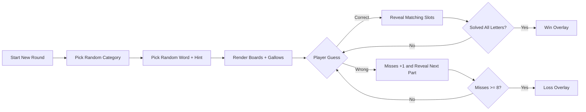
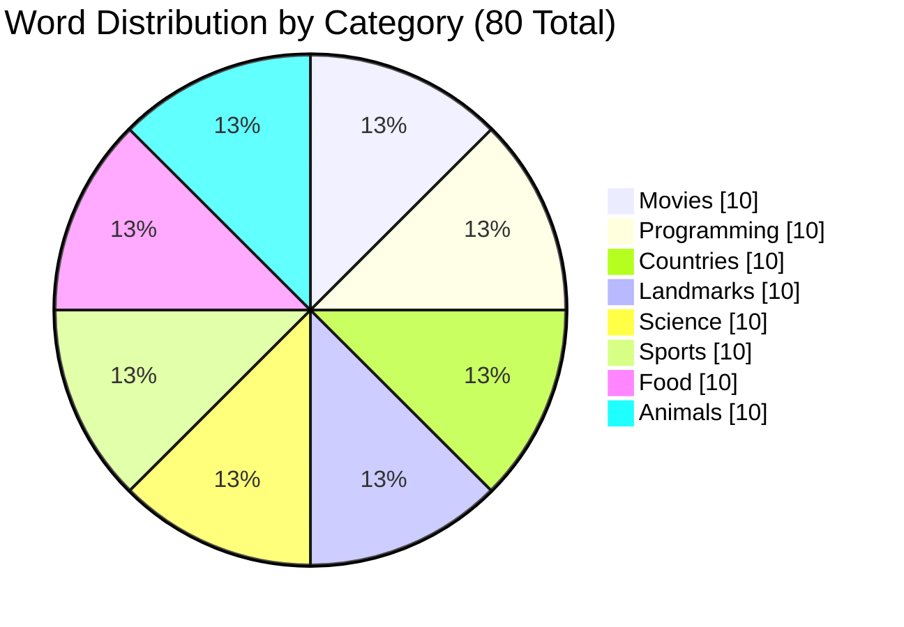

<p align="center">
	
</p>

<p align="center">
	
	
	
	
	
</p>

## Hangman Studio

A modern, animated Hangman game built with TypeScript and zero framework overhead.

This project is designed to feel visual and dynamic:

- Animated ambient background glows
- Progressive gallows reveal transitions
- Bold typography and high-contrast panels
- Fast keyboard + mouse gameplay loop

## Visual Effects

The UI uses deliberate visual motion and color contrast, not a plain static layout.

- Entrance motion: hero and board rise-in animations
- Ambient layers: fixed blurred color orbs for depth
- Gallows animation: each part fades/scales into view
- Focus states: high-visibility dashed outlines for keyboard users

## Color System

Primary palette from the UI theme:

<p>
	
	
	
	
	
	
</p>

## Charts

### 1) Game Flow Chart



### 2) Word Bank Distribution



### 3) Miss Progression Chart

| Misses | Visible Parts | Risk Meter |
|---|---:|---|
| 0 | 0/8 | [........] Safe |
| 1 | 1/8 | [#.......] |
| 2 | 2/8 | [##......] |
| 3 | 3/8 | [###.....] |
| 4 | 4/8 | [####....] Mid |
| 5 | 5/8 | [#####...] |
| 6 | 6/8 | [######..] |
| 7 | 7/8 | [#######.] Critical |
| 8 | 8/8 | [########] Lost |

## Feature Highlights

- Randomized rounds from an 8-category word bank
- Hints with category and metadata display
- Full keyboard input handling (A-Z)
- Clickable on-screen alphabet grid
- Round-end dialog with quick replay
- Strict TypeScript setup for safer maintenance

## Project Structure

```text
.
|- index.html
|- style.css
|- main.ts
|- tsconfig.json
|- dist/
|  |- main.min.js
|  |- main.d.ts
|  |- main.d.ts.map
|  |- main.js.map
```

## Run Locally

Open index.html directly in a browser to play.

For development, run TypeScript compile checks:

```powershell
tsc
```

Use watch mode while editing:

```powershell
tsc --watch
```

Note: index.html loads dist/main.min.js. Keep that file updated in your build workflow.

## Quick Customization

- Add words: edit WORD_BANK in main.ts
- Change difficulty: edit MAX_MISSES in main.ts
- Change visual style: edit CSS variables in style.css under :root

## Troubleshooting

- If UI is visible but not interactive, confirm dist/main.min.js exists.
- If changes do not appear, hard refresh the browser cache.
- If startup fails, verify required data attributes in index.html were not removed.

## License

Use this as a learning or portfolio project. Add a LICENSE file for public distribution.